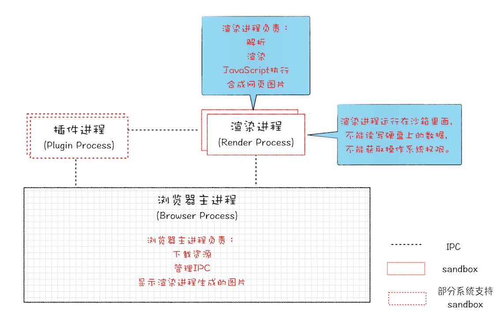
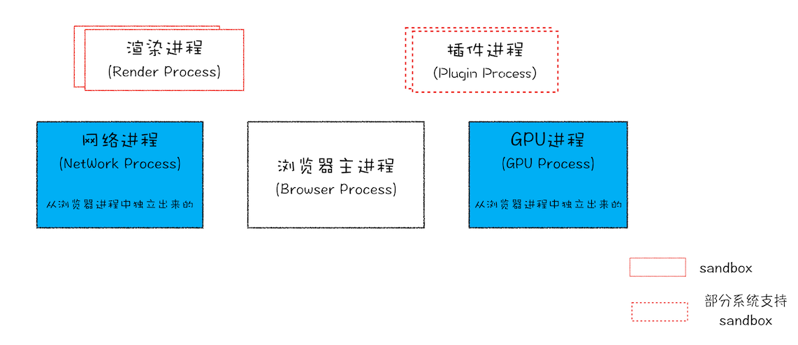
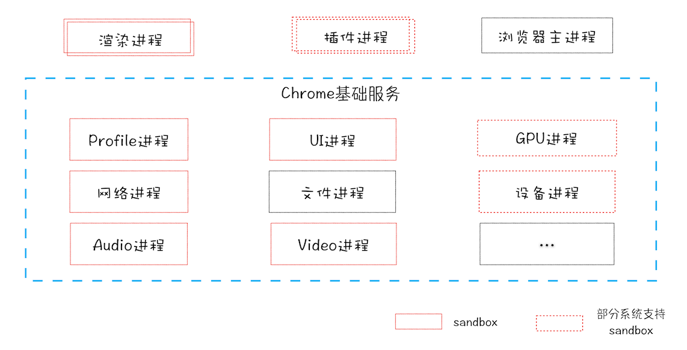
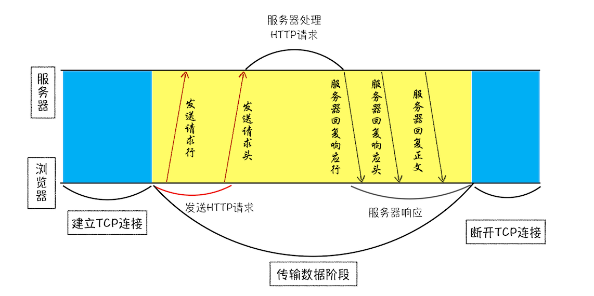
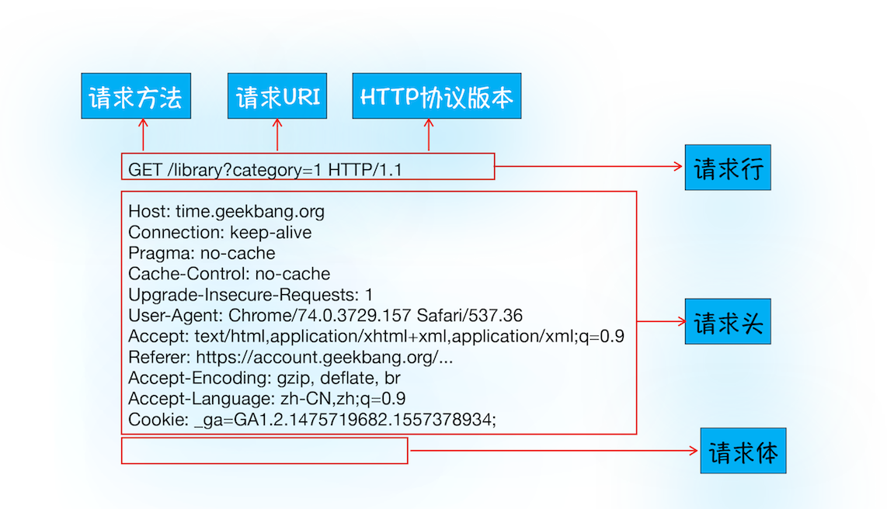
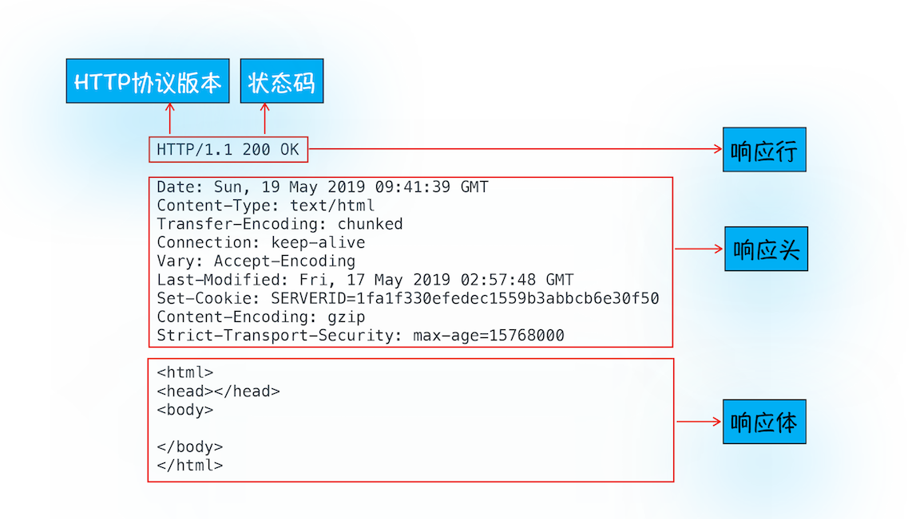
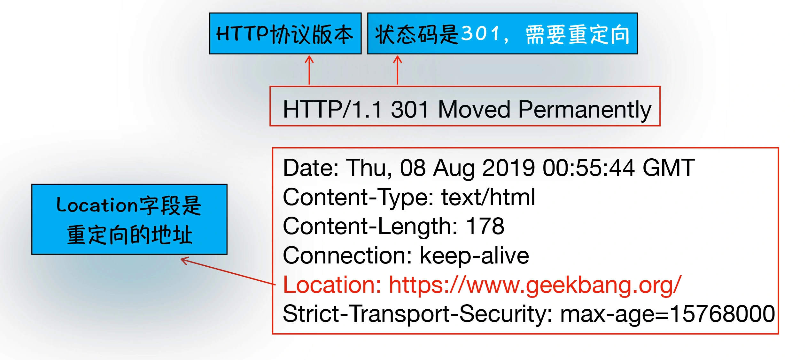
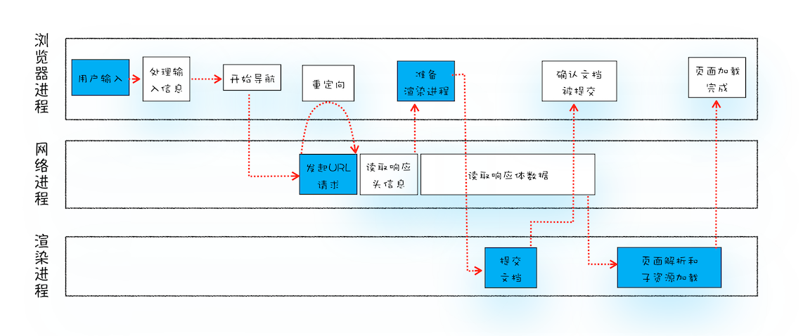

#### 进程与线程的区别

1. 进程是一个程序，在内存中有单独的代码区，数据区等

2. 线程不能单独存在，需要使用进程里面的代码，数据等

#### 浏览器架构

##### 单进程浏览器

- 组成

    1. 页面线程

        - 页面渲染

        - js环境

        - 插件

    2. 网络线程

    3. 其他线程

- 缺点

    1. 不稳定， 任意线程出现了问题，整个浏览器都会崩溃

    2. 不流畅， 渲染，插件，js都在一个线程中，同一时刻只能有一个模块执行

    3. 不安全

##### 多进程浏览器

- 2008之前的架构

- 2008之后的架构

- 未来的架构
面向服务的架构，对于架构这一方面不是很清楚。。。

##### 多进程的功能

- 浏览器主进程

    1. 界面显示

    2. 用户交互

    3. 子进程管理

    4. 存储功能

- 渲染进程

    1. html转换

    2. css转换

    3. js转换

- GPU进程

- 网络进程

- 插件进程

#### HTTP请求流程

##### 请求

1. 构建请求行信息

2. 查找缓存（**根据什么去查找缓存**）？？？

3. 查找ip跟端口|进行dns域名解析

    tcp如何发送http的？

    先发送请求行
    再发送请求头
    再发送请求体
    返回也是如此
    

4. 等待TCP队列

    同一个域名只能建立6个TCP链接（浏览器是否会合并tcp链接，大概率不会了）

5. 建立tcp连接

6. 发送http请求

##### 返回

##### 重定向

相应行状态码：301
响应头字段： Location(重定向过去的地址)

#### URL到页面展示-导航模块

1. 导航流程

#### URL到页面展示-渲染模块

##### 该部分的学习方法：

1. 查看每个子阶段的输入内容

2. 每个子阶段的处理过程

3. 查看每个子阶段的输出内容

##### 过程

1. 构建dom树

    输入：html字符串
    输出：输出树状dom，存在内存中

    html与dom的区别：
    1. html是字符串
    2. dom是对象，是对html的描述与补充

2. 样式计算

    输入： 通过link引用的css文件、通过<<style>>标记的行内样式、元素的内嵌css、dom树

    处理：

    1. 将三个来源的css转换为浏览器可以理解的styleSheets(可以通过document.styleSheet访问)

    2. 对样式表中的属性值进行标准化

    3. 计算dom树中每个节点的具体样式（css继承规则和层叠规则， 可以通过computedStyle访问计算后的样式）

    输出： 

    1. styleSheet

    2. dom树上每个节点添加 了computedStyle

3. 布局

    输入：dom节点
    输出：布局树（加入了节点的位置）

    创建布局树：

    1. 遍历 DOM 树中的所有可见节点，并把这些节点加到布局树中；

    2. 不可见的节点（header,display:none）

    布局计算：计算布局树节点的坐标位置

    
4. 分层（开发者工具Layers查看）

    输入：布局树
    输出：图层树

    提升为单独图层的情况

    1. 元素有层叠上下文属性，比如z-index

    2. 需要裁剪的地方（？？？）

5. 图层绘制

    每个图层制作绘制指令

6. 栅格化

    1. 渲染进程中的主进程把绘制列表交给合成线程

    2. 合成线程会将图层分为图块，通常是256x256或者512x512

    3. 合成线程会按照视口附近的图块生成位图，栅格化过程就是生成位图的过程（通常使用GPU，生成的位图保存在gpu内存中）

7. 合成与显示

    使用transform直接跳过布局和重绘，直接合成

    1. 所有的图块被光栅化完，合成线程给浏览器进程发送命令“DrawQuard”

    2. 浏览器进程调用gpu,按照指令开始绘制页面（内存中，用cpu执行也可以）

    
    

