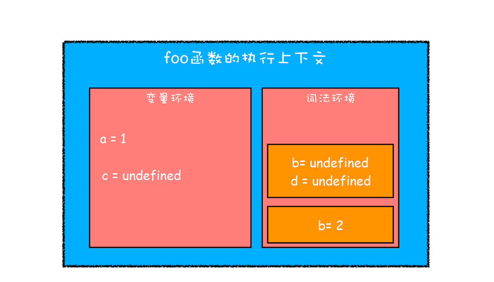

#### 作用域链


##### 什么是作用域

变量与函数的可访问范围与生命周期（不包括this等）


##### 有哪些作用域

函数作用域、全局作用域、块作用域（try...catch()、let、const,解决了变量提升带来的问题）


##### 块级作用域

1. 块级作用域解决了变量提升的问题

2. 代码块内部定义的变量在代码块外部是访问不到的

3. 代码块中的代码执行完后，定义的变量会被销毁（可以用来优化代码）

4. 块级作用域中的变量存放在**词法环境**中

5. js如何保存块级作用域的？

    使用上下文环境中的词法变量来实现块级作用域

    ```javascript

        
        function foo(){
            var a = 1
            let b = 2
            {
            let b = 3
            var c = 4
            let d = 5
            console.log(a)
            console.log(b)
            }
            console.log(b) 
            console.log(c)
            console.log(d)
        }   
        foo()
    
    ```

    


##### 什么是作用域链

1. **作用域链**不是按照**函数调用栈**的顺序去访问变量；

2. **作用域链**而是按照**词法作用域**的顺序去访问；

3. 作用域链主要是用来查找变量的；跟this的规则不一样；

4. 作用域链由变量环境中的outer链接，outer指向词法作用域的上一级执行上下文

5. 当前上下文中没有的变量，可以去作用域链去查找（调用函数定义的上一层）


##### 什么是词法作用域？

词法作用域也是由函数作用域、全局作用域组成；

词法作用域在写代码的时候就决定了；

##### 作用域链的查找顺序

1. 当前上下文的词法环境
2. 当前上下文的变量环境
3. 作用域链上一层的词法环境
4. 作用域链上一次的变量环境


##### 闭包


#### this机制

##### this机制的规则

1. 全局指向window

2. 函数中的this指向(又调用环境决定)

##### this的缺陷

1. 嵌套函数的this不会从外层函数继承

2. 普通函数默认指向全局对象window,应该指向undefined


#### 变量提升


变量提升是因为js执行的时候，会先编译，再执行；编译时，js引擎会先把一部分变量、函数存储到内存中，所以造成了变量提升；


#### js的执行过程

1. 在编译阶段， 一段js代码会被编译成**可执行代码**与**数据**（数据为变量、函数等），并直接在内存中分配地址; 执行阶段，会从

    内存中执行可执行代码部分

2.  js编译阶段与编译语言对比：

    - 编译语言编译的过程，是给变量、函数等分配地址，等执行的时候，才会真正分配内存

    - js引擎编译时，会直接分配真正的内存


#### 之前的概念有： 

##### 执行上下文:

- 全局执行上下文 和 函数执行上下文

    执行上下文是可执行代码需要用到数据的集合（代码的运行环境）， 包括变量环境、this等

- 执行上下文包括    

    - 变量环境-存放var定义的变量

        - outer——作用域链，指向链接的执行上下文

    - 词法环境-存放let、const定义的变量

    - this链

    

##### 调用栈

    调用栈用来管理函数调用，也是用来管理执行上下文，所以也叫做执行上下文栈


